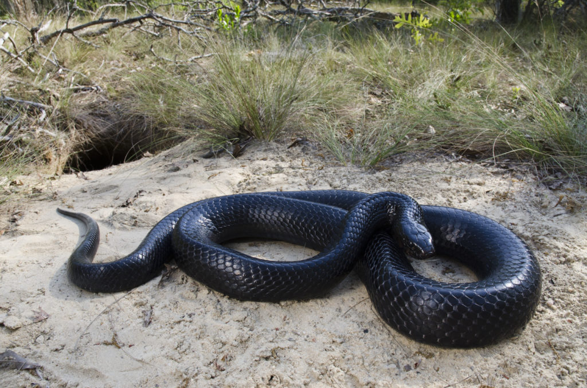

```{r setup, include=FALSE}
knitr::opts_chunk$set(echo = FALSE)
library(knitr)
```

## Introduction

Eastern Indigo Snakes (EIS) are the largest colubrid snakes in North America.
Currently, they are federally listed as Theatened, and there are ongoing efforts to conserved the species. 


```{r, echo = FALSE , out.width="30%"}

```

Something new