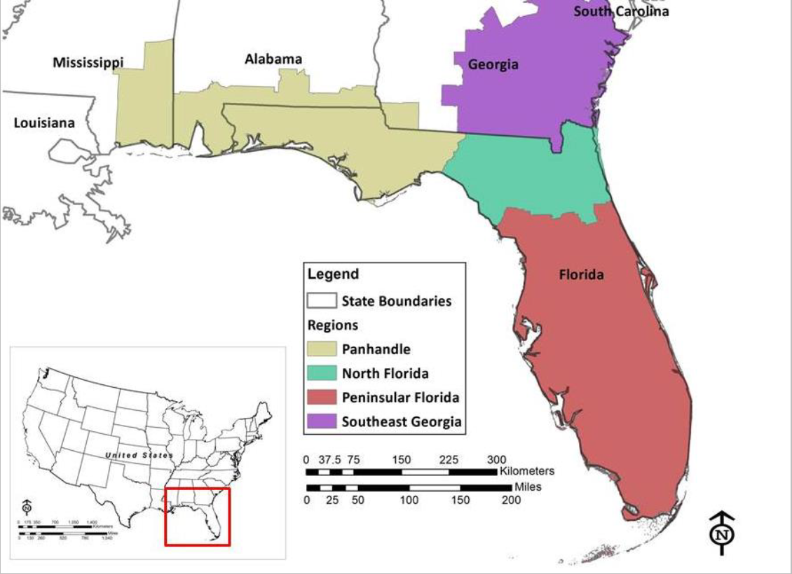
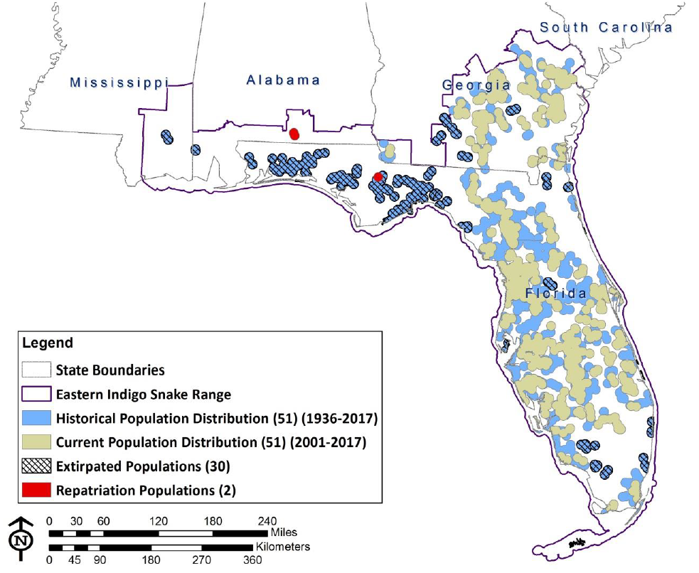

```{r setup, include=FALSE}
knitr::opts_chunk$set(echo = FALSE)
library(knitr)
library(bookdown)
```

## Introduction

Eastern Indigo Snakes (EIS) are the largest colubrid snakes in North America, and is endemic to the southeastern United States.
Currently, they are federally listed as Threatened due to the massive amounts of habitat destruction that have historically occurred in the southeastern Longleaf Pine ecosystems. 
Historically, the species ocurred throughout Florida, southern Georgia, southern Alabama, and perhaps even parts of Mississippi. (Figure \@ref(fig:historic-distro))
However, the current range only includes Florida and southeastern Georgia (Figure \@ref(fig:current-distro)). 


```{r historic-distro, echo = FALSE , out.width="80%", fig.align = 'center', fig.cap = " The historic distribution of *Drymarchon couperi*,figure from the USFW SSA for EIS"}

```


```{r current-distro, echo = FALSE , out.width="80%", fig.align = 'center', fig.cap = "The current distribution of *Drymarchon couperi*, figure from the USFW SSA for EIS"}

```


```{r, echo = FALSE , out.width="80%", fig.align = 'center', fig.cap = "An Eastern Indigo Snake *Drymarchon couperi*"}
include_graphics("images/indigo-snake-OCIC.jpg")
```
